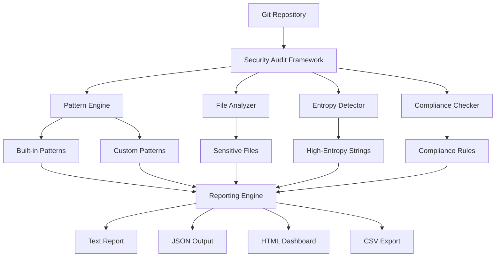

# 🛡️ Git Security Audit Framework

[](https://github.com/Franklin-Andres-Rodriguez/git-security-audit/actions)
[](https://github.com/Franklin-Andres-Rodriguez/git-security-audit/security)
[](https://opensource.org/licenses/MIT)
[](https://www.gnu.org/software/bash/)
[](https://github.com/Franklin-Andres-Rodriguez/git-security-audit/releases)
[](https://github.com/Franklin-Andres-Rodriguez/git-security-audit/releases)

> **Professional-grade security auditing framework for Git repositories with comprehensive secret detection, compliance checking, and enterprise-ready reporting.**

## 🌟 Why Git Security Audit Framework?

In today's DevSecOps landscape, **45% of data breaches** involve leaked credentials committed to version control systems. This framework provides enterprise-grade security auditing capabilities to detect, analyze, and remediate security vulnerabilities in your Git repositories **before** they become incidents.

### ✨ **Key Features**

🔍 **Comprehensive Secret Detection**
- 20+ built-in patterns (AWS, GitHub, JWT, API keys, database credentials)
- High-entropy string analysis for unknown secrets
- Custom pattern support for organization-specific credentials

🏢 **Enterprise Compliance**
- PCI DSS, HIPAA, GDPR, SOX, and ISO 27001 compliance checks
- Automated audit trail generation
- Executive-ready security reports

⚡ **Developer-Friendly**
- Zero-configuration scanning with intelligent defaults
- Multiple output formats (JSON, CSV, HTML, text)
- CI/CD pipeline integration ready

🛠️ **Flexible & Scalable**
- Modular scan types (quick, comprehensive, targeted)
- Branch and depth scope control
- Exclude patterns for large repositories

## 🚀 Quick Start

### One-Line Installation
```bash
curl -fsSL https://raw.githubusercontent.com/Franklin-Andres-Rodriguez/git-security-audit/main/scripts/install.sh | bash
```

### Basic Usage
```bash
# Quick security scan
git-security-audit --type quick

# Comprehensive audit with entropy analysis
git-security-audit --type comprehensive --entropy

# Search for specific secret
git-security-audit --secret "your-api-key-here"

# PCI compliance check
git-security-audit --compliance pci --output json
```

### Example Output
```bash
🛡️ Git Security Audit Framework v2.0.0
Security audit for: /path/to/your/project

✅ SECURITY STATUS: No obvious secrets detected

📋 RECOMMENDED NEXT STEPS:
1. Implement pre-commit secret scanning
2. Add CI/CD security gates
3. Schedule regular security audits

📊 Detailed Results:
   Audit Directory: security-audit/scan-20241216-143052
   Text Report: security-audit/scan-20241216-143052/reports/security-audit-report.txt
   JSON Report: security-audit/scan-20241216-143052/reports/security-audit-report.json
```

## 📖 Documentation

| Resource | Description |
|----------|-------------|
| [📚 Installation Guide](docs/installation.md) | Complete installation options and requirements |
| [🎯 Usage Examples](docs/usage-examples.md) | Real-world use cases and command examples |
| [⚙️ Configuration](docs/configuration.md) | Advanced configuration and custom patterns |
| [🏢 Compliance Guide](docs/compliance-guide.md) | Industry compliance frameworks support |
| [🔧 Troubleshooting](docs/troubleshooting.md) | Common issues and solutions |
| [📋 API Reference](docs/api-reference.md) | Complete command-line interface documentation |

## 🔧 Advanced Usage

### CI/CD Integration

#### GitHub Actions
```yaml
name: Security Audit
on: [push, pull_request]
jobs:
  security-scan:
    runs-on: ubuntu-latest
    steps:
      - uses: actions/checkout@v4
        with:
          fetch-depth: 0  # Full history for comprehensive scan
      - name: Run Git Security Audit
        run: |
          curl -fsSL https://raw.githubusercontent.com/Franklin-Andres-Rodriguez/git-security-audit/main/scripts/install.sh | bash
          git-security-audit --type secrets --output json > security-results.json
      - name: Upload Security Report
        uses: actions/upload-artifact@v4
        with:
          name: security-audit-report
          path: security-results.json
```

#### GitLab CI
```yaml
security-audit:
  stage: security
  script:
    - curl -fsSL https://raw.githubusercontent.com/Franklin-Andres-Rodriguez/git-security-audit/main/scripts/install.sh | bash
    - git-security-audit --type comprehensive --output json
  artifacts:
    reports:
      security: security-audit-*/reports/*.json
  only:
    - main
    - develop
```

### Custom Pattern Detection
```bash
# Create custom patterns file
cat > custom-patterns.conf << 'EOF'
SECRET_PATTERNS["custom_api"]="CUSTOM_[A-Z0-9]{16}"
SECRET_PATTERNS["internal_token"]="INT_[a-f0-9]{32}"
EOF

# Use custom patterns
git-security-audit --patterns custom-patterns.conf --type secrets
```

### Compliance Automation
```bash
# Monthly PCI compliance report
git-security-audit --compliance pci --output html > compliance-$(date +%Y%m).html

# SOX audit with detailed findings
git-security-audit --compliance sox --verbose --output json | \
  jq '.findings_files[] | select(.count > 0)'
```

## 🎯 Use Cases

### 1. **Daily Development Security**
```bash
# Pre-commit hook
git-security-audit --type quick --quiet
```

### 2. **Release Security Gates**
```bash
# Block releases with secrets
if [ $(git-security-audit --type secrets --output json | jq '.total_findings') -gt 0 ]; then
  echo "❌ Release blocked: Secrets detected"
  exit 1
fi
```

### 3. **Incident Response**
```bash
# Search for specific leaked credential
git-security-audit --secret "AKIA1234567890EXAMPLE" --verbose
```

### 4. **Compliance Auditing**
```bash
# Generate executive compliance report
git-security-audit --compliance pci --type comprehensive --output html
```

## 🏗️ Architecture



## 🔍 Detection Capabilities

### Secret Patterns Supported
- **Cloud Providers**: AWS Access Keys, Azure Storage, Google API Keys
- **Version Control**: GitHub Tokens, GitLab Tokens, SSH Keys
- **Databases**: MySQL, PostgreSQL, MongoDB, Redis connection strings
- **Authentication**: JWT Tokens, Bearer Tokens, Basic Auth
- **Certificates**: SSL Private Keys, PGP Keys, SSH Private Keys
- **Custom**: Configurable patterns for organization-specific secrets

### Compliance Frameworks
- **PCI DSS**: Credit card data, PAN detection
- **HIPAA**: Healthcare information, PHI patterns
- **GDPR**: Personal data indicators
- **SOX**: Financial audit trails
- **ISO 27001**: Information security patterns

## 📊 Performance

| Repository Size | Scan Type | Execution Time | Memory Usage |
|----------------|-----------|----------------|--------------|
| Small (< 1K commits) | Quick | < 5 seconds | < 50MB |
| Medium (< 10K commits) | Comprehensive | < 30 seconds | < 200MB |
| Large (< 100K commits) | Comprehensive | < 5 minutes | < 500MB |
| Enterprise (> 100K commits) | Comprehensive | < 15 minutes | < 1GB |

## 🤝 Contributing

We welcome contributions from the community! Please see our [Contributing Guide](CONTRIBUTING.md) for details.

### Quick Development Setup
```bash
# Fork and clone
git clone https://github.com/Franklin-Andres-Rodriguez/git-security-audit.git
cd git-security-audit

# Install development dependencies
./scripts/setup-dev.sh

# Run tests
./tests/test-runner.sh

# Create feature branch
git checkout -b feature/amazing-improvement
```

## 🛡️ Security

This project follows responsible security practices:

- 🔐 All releases are signed with GPG
- 🔍 Automated security scanning with CodeQL
- 📋 Regular dependency updates via Dependabot
- 🛡️ Security policy and vulnerability reporting in [SECURITY.md](SECURITY.md)

**Found a security vulnerability?** Please report it responsibly through our [security policy](SECURITY.md).

## 📄 License

This project is licensed under the MIT License - see the [LICENSE](LICENSE) file for details.

## 🌟 Star History

[](https://star-history.com/#Franklin-Andres-Rodriguez/git-security-audit&Date)

## 🙏 Acknowledgments

- Inspired by the DevSecOps community's need for accessible security tools
- Built with ❤️ for developers who care about security
- Special thanks to all [contributors](https://github.com/Franklin-Andres-Rodriguez/git-security-audit/graphs/contributors)

## 📞 Support & Community

- 💬 [Discussions](https://github.com/Franklin-Andres-Rodriguez/git-security-audit/discussions) - Ask questions, share ideas
- 🐛 [Issues](https://github.com/Franklin-Andres-Rodriguez/git-security-audit/issues) - Report bugs, request features
- 📧 [Email](mailto:security@yourproject.com) - Direct contact for enterprise support
- 🐦 [Twitter](https://twitter.com/yourhandle) - Follow for updates

---

<div align="center">

**Made with ❤️ by the DevSecOps community**

[⭐ Star this repo](https://github.com/Franklin-Andres-Rodriguez/git-security-audit) • [🔀 Fork it](https://github.com/Franklin-Andres-Rodriguez/git-security-audit/fork) • [📝 Contribute](CONTRIBUTING.md)

</div>
